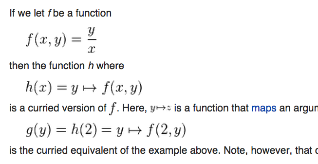

% Applicatives, Alternative, and Aeson
% Levi Schuck
% March 3, 2015

# Currying
## Brief intro / reminder
It's hard to talk about applicatives if we don't talk about how functions
are *applied*.

## Not that curry.


## Maybe this one?


Well, it's kinda mathy..

## Haskell example
Let's try a Haskell syntax approach.
```haskell
append x y = x ++ y
```

Let's start with http

```haskell
http x = "http://" ++ x
```

## But we can do better!
```haskell
append x y = x ++ y
```
What if.. we rewrite this function.

```haskell
http x = append "http://" x
```

Okay, but where does currying come in?

## Currying http
So, with the following:
```haskell
append x y = x ++ y
http x = append "http://" x
```
We could rewrite http to be infinitesimally shorter!
```haskell
append x y = x ++ y
http = append "http://"
```

## Where did the `x` go?

```haskell
http = append "http://"
```

## The types are still the same
```haskell
http x = append "http://" x
http :: [Char] -> [Char]

http' = append "http://"
http' :: [Char] -> [Char]
```
We didn't specify the parameter x, yet the type still takes something.

**Currying!**

## 99 functions of x on the wall, 99 functions of x. Take one down, pass it around, 98 functions of x on the wall.
So, applying a parameter cuts the remaining parameters on the type
```haskell
append                        :: [a] -> [a]    -> [a]
append "http://"              ::        [Char] -> [Char]
append "http://" "google.com" ::                  [Char]
```

## But back to currying

So, we have established that by applying one parameter to a two-parameter function,
we are left with a one parameter function.

Haskell lets us skip parameters in our declaration if the types match up on the tail
of the type.

# Applicative

## What's an ap.. ap... applicative?
```haskell
class (Functor f) => Applicative f where  
    pure :: a -> f a  
    (<*>) :: f (a -> b) -> f a -> f b
```
+ `pure` lifts a value into the context of the Applicative functor.
+ `<*>` takes a functor of a function, a functor with a value, then applies
    the first function to the given value, and results in whatever the function
    decides.

## Let's start with Maybe
(Not the official implementation, but similar)
```haskell
instance Applicative Maybe where
    pure x = Just x
    Nothing <*> _ = Nothing
    _ <*> Nothing = Nothing
    Just x <*> Just y = Just (x y)
```

## Example program
```haskell
main = do                               -- λ> main
    putStr "a: "                        -- a: 1
    a' <- getLine                       -- b: 2
    let a = readMaybe a' :: Maybe Int   -- c: Just (1,2)
    putStr "b: "                        -- λ> main
    b' <- getLine                       -- a: Nope
    let b = readMaybe b' :: Maybe Int   -- b: 4
    let c = pure (,) <*> a <*> b        -- c: Nothing
    putStr "c: "                        -- λ> main
    putStrLn $ show c                   -- a: 2
                                        -- b: Nope
                                        -- c: Nothing
```

## What about the fabeled `<$>`
It's actually just `fmap` from functor.

What does `Maybe`'s `fmap` look like?

```haskell
instance  Functor Maybe  where
    fmap _ Nothing       = Nothing
    fmap f (Just a)      = Just (f a)
```
Remember when we used pure?
```haskell
let c = pure (,) <*> a <*> b
-- It can be rewritten as
let c = (,) <$> a <*> b
```

## Let's step through this
```haskell
let a = Just 1
    b = Just 2
    c = (,) <$> a <*> b
    c = Just (1,) <*> b
    c = Just (1,2)
```
```haskell
let a = Nothing
    b = Just 4
    c = (,) <$> a <*> b
    c = Nothing <*> b
    c = Nothing
```
```haskell
let a = Just 4
    b = Nothing
    c = (,) <$> a <*> b
    c = Just (4,) <*> b
    c = Nothing
```

## Or.. really more like
```haskell
let a = Just 1
    b = Just 2
    (,) = \x -> \y -> (x,y)
    c = (,) <$> a <*> b
    c = (,) <$> Just 1 <*> Just 2
    c = Just (let x = 1 in \y -> (x,y)) <*> Just 2
    c = Just (let x = 1
                  y = 2 in (x,y))
    c = Just (1,2)
```

# Alternative
## Typeclass definition
With this, we have the ability to take the first thing that works.
```haskell
class Applicative f => Alternative f where
    -- | The identity of '<|>'
    empty :: f a
    -- | An associative binary operation
    (<|>) :: f a -> f a -> f a

instance Alternative Maybe where
    empty = Nothing
    Nothing <|> right = right
    left    <|> _     = left
```
Which is to say "if we don't have anything yet, try the next thing"

## Blunt example

```haskell
example = Nothing <|> Just 3 <|> Nothing <|> Just 2 <|> Just 1
example = Just 3
```

## Repeat a, b, c
```haskell
main = do
    putStr "a: "
    a' <- getLine
    let a = readMaybe a' :: Maybe Int
    putStr "b: "
    b' <- getLine
    let b = readMaybe b' :: Maybe Int
    let c = a <|> empty <|> b
    putStr "c: "
    putStrLn $ show c
```
+ When `a` is `Just 1`, no matter what `b` is, `c` is `Just 1`.
+ When `a` is `Nothing`, and `b` is `Just 2`, `c` is `Just 2`.
+ When `a` is `Nothing`, `b` is `Nothing`, then `c` is `Nothing`.
+ `empty` is synonymous to `Nothing` here.

## Evaluate the alternative
```haskell
example2 = Nothing <|> Nothing <|> Just 3 <|> Just 4
example2 =             Nothing <|> Just 3 <|> Just 4
example2 =                         Just 3 <|> Just 4
example2 =                         Just 3
```

# Where this leads
So, after all these wonderful concepts have been discussed,
where are we heading with this?

We can use Currying, Applicatives, and Alternatives to parse JSON documents
and get the first *reasonable* value.


# Aeson
## It is a library
Aeson lets us encode and decode our data types with JSON.
```haskell
data Person = Person
    { name :: Text
    , age  :: Int
    } deriving Show
instance FromJSON Person where
    parseJSON (Object v) = Person <$> v .: "name" <*> v .: "age"
    -- A non-Object value is of the wrong type, so fail.
    parseJSON _          = mzero
instance ToJSON Person where
    toJSON (Person name age) = object ["name" .= name, "age" .= age]
-- (.:) and (.=) are custom aeson infix operators
>>> decode "{\"name\":\"Joe\",\"age\":12}" :: Maybe Person
Just (Person {name = "Joe", age = 12})
```
See the Currying and Applicative being used?

## Curry and Applicative
```haskell
data Person = Person Text Int
instance FromJSON Person where
    parseJSON (Object v) = Person <$> v .: "name" <*> v .: "age"
-- In this case, v .: "name" is :: Parser Text
-- In this case, v .: "age"  is :: Parser Int
-- Parser is a member of the Applicative typeclass and
--   acts much like Maybe
Person ::  Text -> Int -> Person
Person "Joe"    :: Int -> Person
Person "Joe" 12 ::        Person
```


## What about sum types?
```haskell
data Color = ARGB Int Int Int Int
           | RGB Int Int Int
           | HSV Float Float Float
           | CMYK Float Float Float Float
```
Some try to go for something like..
```json
{"type":"argb","value":{"alpha":255,"red":128,"green":195,"blue":237}}
{"type":"hsv","value":{"hue":203.12,"saturation":75.17,"value":71.57}}
```
But doesn't that seem a little clunky..?

## Encoding sum types
```haskell
data Color = ARGB Int Int Int Int  | RGB Int Int Int
           | HSV Float Float Float | CMYK Float Float Float Float
instance ToJSON Color where
    toJSON (ARGB a r g b) = object
        ["alpha" .= a, "red" .= r, "green" .= g, "blue" .= b]
    toJSON (RGB r g b) = object
        ["red" .= r, "green" .= g, "blue" .= b]
    toJSON (HSV h s v) = object
        ["hue" .= h, "saturation" .= s, "value" .= v]
    toJSON (CYMK c y m k) = object
        ["cyan" .= c, "yellow" .= y, "magenta" .= m, "key" .= k]
encode $ ARGB 255 128 195 237
>>> "{\"red\":128,\"alpha\":255,\"green\":195,\"blue\":237}"
encode $ HSV 203.12 75.17 71.57
>>> "{\"hue\":203.12,\"saturation\":75.17,\"value\":71.57}"
```
We can do this, but can we recover which constructor to use? (ARGB vs RGB)

## What about alternative?
```haskell
instance FromJSON Color where
    parseJSON (Object v)
        =   ARGB <$> v .: "alpha"
                 <*> v .: "red"
                 <*> v .: "green"
                 <*> v .: "blue"
        <|> RGB  <$> v .: "red"
                 <*> v .: "green"
                 <*> v .: "blue"
        <|> HSV  <$> v .: "hue"
                 <*> v .: "saturation"
                 <*> v .: "value"
        <|> CYMK <$> v .: "cyan"
                 <*> v .: "yellow"
                 <*> v .: "magenta"
                 <*> v .: "key"
```
## Demo of alternative
```haskell
>>> let json = "{\"red\":128,\"alpha\":255,\"green\":195,\"blue\":237}"
>>> decode json :: Maybe Color
Just (ARGB 255 128 195 237)
```
Well look at that, we could recover the constructor! (ARGB)

Though we do have a little redundancy with our implementation..

## Slight cleanup
```haskell
instance FromJSON Color where
    parseJSON (Object v)
        = empty
        <|> do r <- v .: "red"
               g <- v .: "green"
               b <- v .: "blue"
               let argb a = ARGB a r g b
               (argb <$> v .: "alpha") <|> (pure $ RGB r g b)
        <|> HSV  <$> v .: "hue"
                 <*> v .: "saturation"
                 <*> v .: "value"
        <|> CYMK <$> v .: "cyan"
                 <*> v .: "yellow"
                 <*> v .: "magenta"
                 <*> v .: "key"
```
This shares the `"red"`, `"green"`, and `"blue"` among both `RGB` and `ARGB`
constructors for `Color`.

# Finale

Let your Haskelling be practical.

And with respect, live long and prosper.


